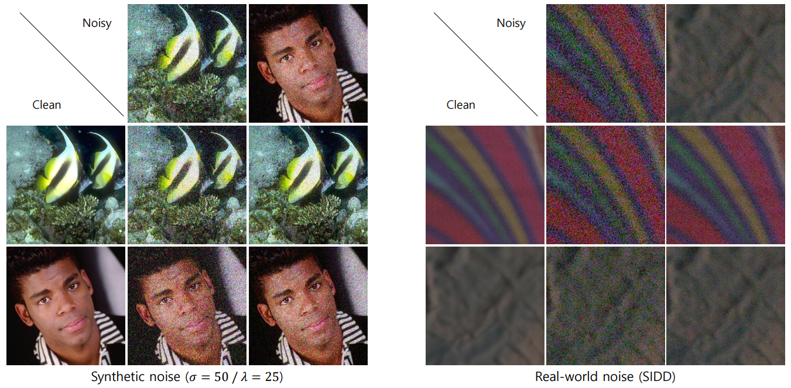

# NoiseTransfer: Image Noise Generation with Contrastive Embeddings
[[Paper](https://openaccess.thecvf.com/content/ACCV2022/html/Lee_NoiseTransfer_Image_Noise_Generation_with_Contrastive_Embeddings_ACCV_2022_paper.html)]


## Abstract
Deep image denoising networks have achieved impressive success with the help of a considerably large number of synthetic train datasets. However, real-world denoising is a still challenging problem due to the dissimilarity between distributions of real and synthetic noisy datasets. Although several real-world noisy datasets have been presented, the number of train datasets (i.e., pairs of clean and real noisy images) is limited, and acquiring more real noise datasets is laborious and expensive. To mitigate this problem, numerous attempts to simulate real noise models using generative models have been studied. Nevertheless, previous works had to train multiple networks to handle multiple different noise distributions. By contrast, we propose a new generative model that can synthesize noisy images with multiple different noise distributions. Specifically, we adopt recent contrastive learning to learn distinguishable latent features of the noise. Moreover, our model can generate new noisy images by transferring the noise characteristics solely from a single reference noisy image. We demonstrate the accuracy and the effectiveness of our noise model for both known and unknown noise removal.





## Environments
- Python 3.7
- Pytorch 1.10.0

### Install some packages
- [piq](https://anaconda.org/photosynthesis-team/piq)
- [ignite](https://anaconda.org/pytorch/ignite)


## Datasets
**Train images**
- [Train Data (HR images)](https://data.vision.ee.ethz.ch/cvl/DIV2K/) and put images in *'train_images/DIV2K'*
- [SIDD-Medium Dataset](https://www.eecs.yorku.ca/~kamel/sidd/dataset.php) and put images in *'train_images/sidd'*

**Test images**
- [SIDD Validation](https://www.eecs.yorku.ca/~kamel/sidd/benchmark.php) and put images in *'test_images/sidd'*
- [SIDD+](https://arxiv.org/pdf/2005.04117.pdf): Download *siddplus_valid_gt_srgb.mat* and *siddplus_valid_noisy_srgb.mat* at this [link](https://bit.ly/siddplus_data) and put images in *'test_images/siddplus'*


## Quickstart
Use pre-trained checkpoints available in ./ckpts and reproduce results in our paper (ALKD/KS and PSNR/SSIM).
```
python supp_tbl.py --gpu 0
```


## Train from scratch
**1. train noise generator**
```
python train_noiseTransfer.py --gpu 0,1
```

**2. train denoiser with generated noisy images by NoiseTransfer**

- on SIDD dataset
```
python train_denoiser.py --gpu 0
```

- on synthetic noise models
```
python train_denoiser_synthetic.py --gpu 0
```


## BibTex
```
@InProceedings{Lee_2022_ACCV,
    author    = {Lee, Seunghwan and Kim, Tae Hyun},
    title     = {NoiseTransfer: Image Noise Generation with Contrastive Embeddings},
    booktitle = {Proceedings of the Asian Conference on Computer Vision (ACCV)},
    month     = {December},
    year      = {2022},
    pages     = {3569-3585}
}
```
